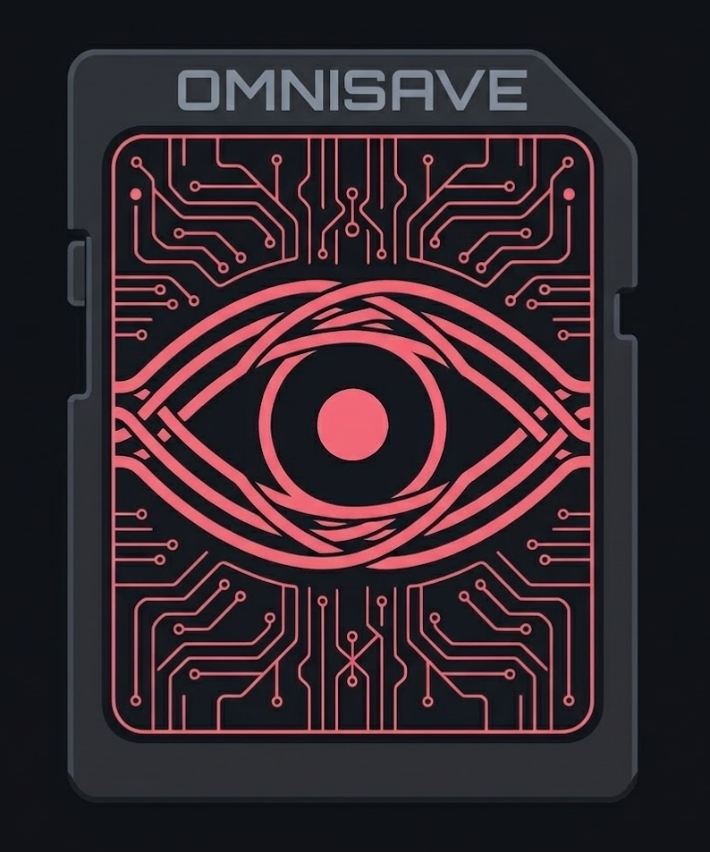
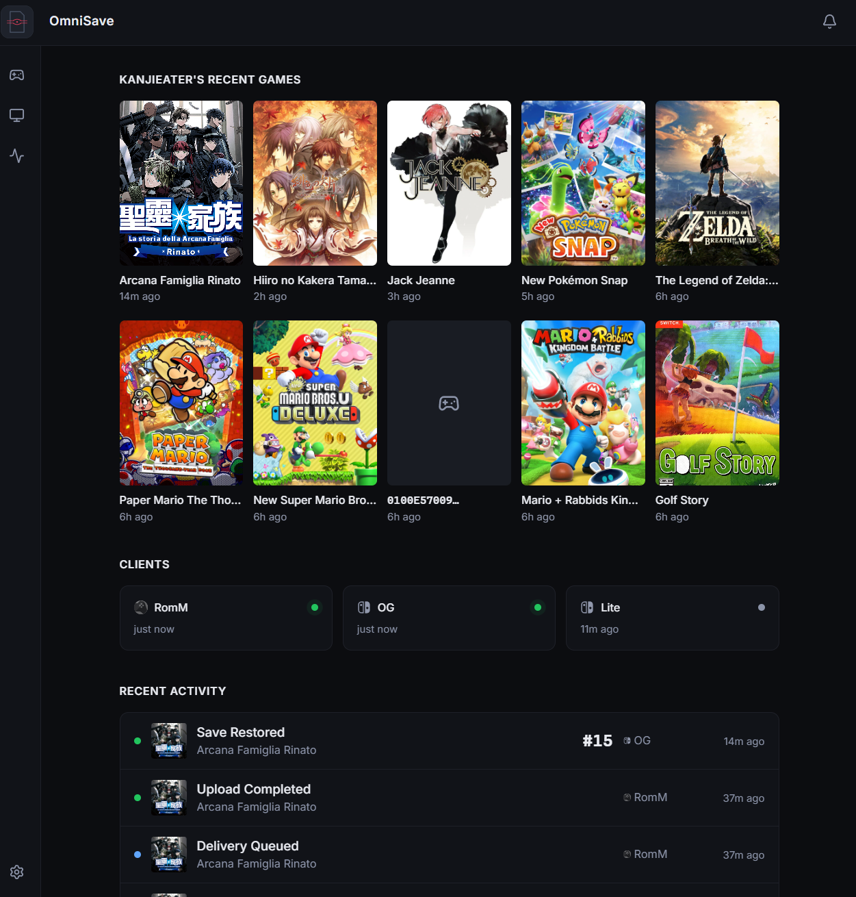
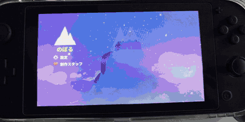
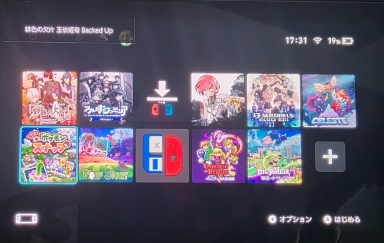
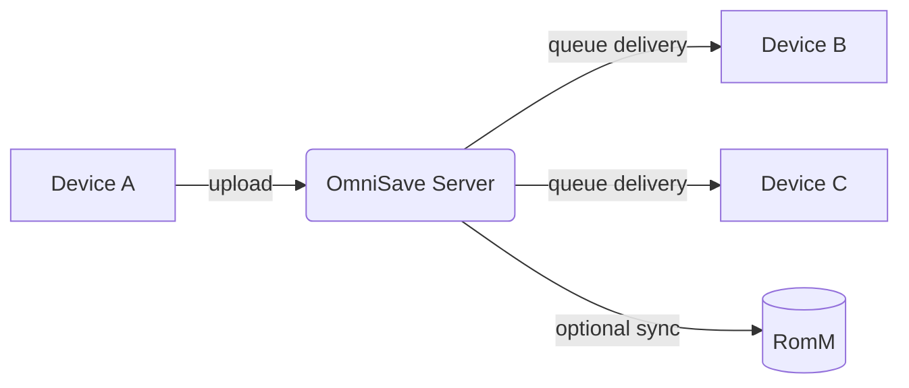
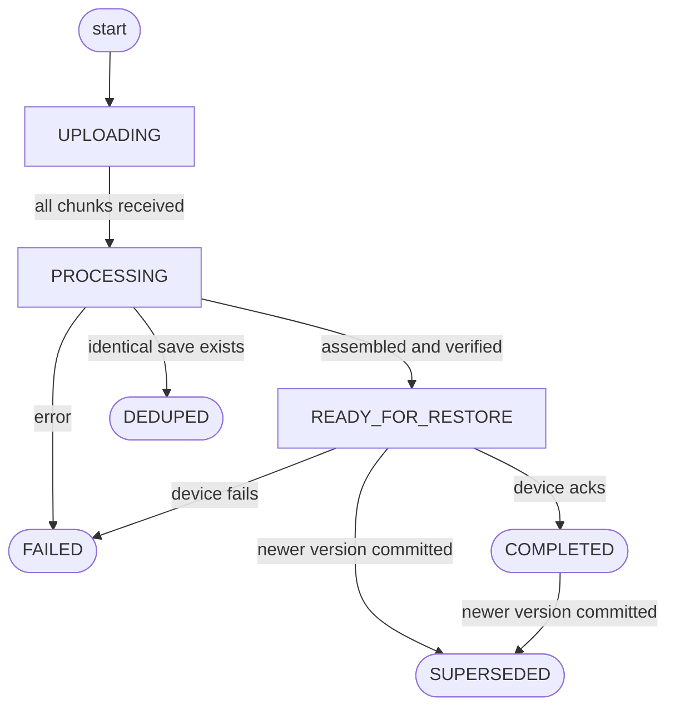

<p align="center">
  
</p>

<h1 align="center">OmniSave</h1>

<p align="center">
  Self-hosted save synchronization and version control for games across multiple devices.
</p>

<p align="center">
  <a href="#quick-start">Quick Start</a> ·
  <a href="#usage">Usage</a> ·
  <a href="#romm-integration">RomM</a> ·
  <a href="#your-data">Your Data</a> ·
  <a href="#security">Security</a> ·
  <a href="#development">Development</a>
</p>

---

If you play games across multiple devices, you know the problem: your handheld has an older save than your home console, and you have to remember which one is current — or manually transfer files before every session.

OmniSave solves this. When a save changes on one device, OmniSave automatically archives the previous version, makes the new save the active version, and distributes it to your other devices. Every previous version is kept. Nothing is ever silently overwritten.

<p align="center">
  
</p>

<p align="center">
  
</p>

---

## What You Get

- **Saves stay in sync automatically.** When a save changes on any device, the others are updated without you doing anything.
- **Every version is kept.** OmniSave never throws away a save. Every previous version is archived and can be pushed back to any device from the web dashboard.
- **Interrupted syncs recover on their own.** If a transfer is cut off — network drop, crash, whatever — it resumes where it left off.
- **Multiple users on one server.** Each person has their own devices, saves, and sync state. Devices can be shared with other users.
- **Multiple player profiles on one device.** Each in-game profile maps to an OmniSave account, so saves go to the right person.
- **Turn off sync per game, per device.** If you don't want a particular game syncing to a particular device, you can disable it from the dashboard without affecting anything else.
- **Full web dashboard.** See the sync state of every game across every device, browse version history, push any save to any device, and manage errors — all from a browser.
- **Optional RomM integration.** If you use RomM, connecting it gives you cover art in the dashboard and bridges saves between physical devices and emulators automatically. Not required for anything else.

---

## Quick Start

### Requirements

- Docker and Docker Compose

```yaml
# docker-compose.yml
services:
  omnisave:
    image: ghcr.io/kanjieater/omnisave:latest
    restart: unless-stopped
    ports:
      - "8991:8991"
    volumes:
      - ./data:/app/data
      - ./config:/app/config
```

```bash
docker compose up -d
```

Open `http://<your-host>:8991` in a browser.

**First-run checklist:**

1. Log in with `admin` / `admin`.
2. Change the admin password immediately (Settings → Account).
3. Install a client on your device — see [Clients](#clients) below.
4. Pair your first device (Devices → Add Device).
5. Optionally create additional user accounts (Admin → Users).

---

## Usage

### Pairing a device

<p align="center">
  
</p>

When a device with the OmniSave client installed connects to the server for the first time, it displays a short pairing code in its overlay. To pair it:

1. Open the web dashboard → **Devices** → **Add Device**.
2. Enter the pairing code shown on the device.
3. The device receives its token automatically on its next poll — no manual configuration needed on the device side.
4. Optionally rename the device and set a default player profile.

### Normal sync

<p align="center">
  
</p>

Normal operation requires no interaction. When a save changes on a device, it uploads to the server, and the server queues it for delivery to every other device that has that game installed. The other devices pick it up on their next poll and restore it before the next game launch.

### Pushing a specific save to a device

If you want to send a particular snapshot to a device — say, an older version, or a save from a different device — go to the game in the dashboard, find the snapshot in the history, and hit Push. You can choose which device(s) to send it to and which player profile it should land on.

### Restoring all saves to a device

Dashboard → Devices → (device) → **Restore All** queues the latest available save for every installed game on that device. Useful after a device reset or reinstall.

### Browsing and managing save history

Dashboard → Games → (game):

- See every saved version, when it was made, and which device it came from.
- Delete individual snapshots you no longer want.
- Push any version back to any device.

### Turning off sync for a game on a specific device

Dashboard → Devices → (device) → Games → toggle the game off. Any pending delivery for that game to that device is cancelled immediately. Other devices are unaffected.

---

## Configuration

### Environment variables

| Variable | Default | Description |
|---|---|---|
| `OMNISAVE_DATA` | `/app/data` | Where the database and save archives are stored. Mount a persistent volume here. |
| `OMNISAVE_PORT_INTERNAL` | `8991` | Port the server listens on inside the container. |

### Recovering a lost admin password

Create an empty file at `/app/config/reset_admin.flag` inside the running container. On the next request, the admin password resets to `admin` and the flag is removed.

```bash
docker exec omnisave touch /app/config/reset_admin.flag
# Log in with admin/admin and change the password immediately.
```

---

## RomM Integration

RomM integration is entirely optional. OmniSave's core save sync — between physical devices — works independently of RomM. If you only play on physical hardware, you don't need it.

The integration is useful if you also play through an emulator or any client that uses RomM as its save backend (web player, mobile emulator client, etc.). In that case, RomM acts as a bridge: saves from physical devices flow into OmniSave and then out to RomM, so they're immediately available in your emulator without any manual export. Saves made in an emulator flow the other direction — into OmniSave and then out to your physical devices.

Beyond save sync, connecting RomM unlocks cover art and game names throughout the dashboard. Without RomM, games show up as bare title IDs. With it, box art and proper titles are fetched from your library and cached locally, which makes the save history and sync status pages much easier to navigate.

### What you get with RomM connected

- **Cover art and game names** in the dashboard, fetched from your RomM library and cached locally.
- **Saves from emulators delivered to physical devices** — saves made in any RomM-backed emulator are pulled into OmniSave and queued for delivery to your hardware.
- **Saves from physical devices delivered to emulators** — when a physical device uploads a new save, OmniSave pushes it to RomM automatically.
- **Auto-mapping** — when a new title is first seen, OmniSave searches your RomM library by game name and links it automatically if exactly one match is found. Titles can also be mapped manually from the game detail page.
- **RomM as a virtual device** — your RomM instance appears in the device list like any other client, with its own per-game sync state.

### Setup

1. In the dashboard, go to **Settings → RomM** and enter your RomM URL and API key.
2. Ensure the API key has permission to read and write saves in RomM.
3. Existing titles will be auto-matched on next upload. You can also map titles manually from the game detail page.

### Multi-user RomM

Each user configures their own RomM connection independently from the dashboard. Credentials are stored per-user.

---

## Your Data

### What gets kept

OmniSave keeps every save that successfully made it to the server. Once a save is committed, it stays until you explicitly delete it. This includes saves that have been replaced by newer versions — they're archived, not removed.

The only things the server cleans up automatically are failed or aborted transfers that never produced a complete save, and those are only removed after 7 days.

### What happens when things go wrong

| Situation | What happens |
|---|---|
| Upload interrupted mid-transfer | Resumes from the last confirmed point. Abandoned sessions expire after 12 hours. |
| Server crashes while saving | Recovered automatically on restart — the save either completes or is cleanly failed. |
| Delivery to a device fails | The save stays queued. Retry from the dashboard or wait for the device to re-try automatically. |
| Two devices save different progress for the same game while offline | Both saves are stored. Neither is discarded. The dashboard shows the state and you can choose which version to push. |
| A save file is identical to what's already on the server | Detected automatically. No extra storage used, no duplicate entry created. |

### What OmniSave does not handle for you

- **Disk durability.** The database and save files are on your filesystem. Back up the `data/` volume — OmniSave doesn't do this for you.
- **TLS.** Run a reverse proxy in front of OmniSave if you're exposing it outside your home network.

---

## Security

OmniSave is designed for **trusted network** use — your home LAN, a VPN, or a private VPS. It is not hardened for exposure to the public internet without a reverse proxy.

- **Dashboard login** uses password hashing and secure session tokens. Sessions are scoped per-login and can be invalidated individually.
- **Devices** never receive credentials automatically. A device only gets a token after a logged-in user explicitly approves it via the pairing code flow. Removed devices have their tokens revoked immediately.
- **Save data never leaves your server** unless you have RomM integration enabled, in which case saves are pushed to your own RomM instance.

### Recommendations for VPS / internet-facing deployments

- Use a reverse proxy with TLS (nginx, Caddy, Traefik).
- Change the admin password before the server is reachable.
- Consider IP-restricting the dashboard if it's on a public host.

---

## Clients

OmniSave uses an open REST API. Any client that implements the sync protocol can participate.

**Current clients:**
- **[OmniSaveSwitch](https://github.com/kanjieater/OmniSaveSwitch)** — a background sysmodule for custom firmware that watches for save changes and handles upload and download automatically.
- **REST API** — full schema at `/docs` on your running server, or browse the [published API reference](https://kanjieater.github.io/OmniSave/).

**Future:**
- PC client with Playnite integration
- Emulator support via the PC client
- Experimental cross-device save conversion
- Per-game and global data retention policies

---

## Architecture

The server runs as a single Docker container serving both the REST API and the React dashboard. All state lives in a SQLite database and a flat archive directory — no external dependencies required.

### Data flow



### Transaction state machine

Every save moves through this state machine. Inbound transactions (uploads from devices) are processed and then forked into one outbound transaction per target device.



### Where data lives

| Path | Contents |
|---|---|
| `$OMNISAVE_DATA/omnisave.db` | All metadata: devices, transactions, snapshot history, user accounts |
| `$OMNISAVE_DATA/archive/` | Committed save files, one subdirectory per snapshot |
| `$OMNISAVE_DATA/staging/` | In-progress uploads; cleaned automatically after processing |

### Tech stack

- Backend: Python 3.11, FastAPI, SQLite, uvicorn
- Frontend: React (Vite), served as a static SPA from the same container
- Optional integration: RomM

---

## Development

### Requirements

- Python 3.11+
- Node.js 20+

### Run tests

```bash
cd server
pip install -r requirements.txt
pytest
```

The test suite uses real SQLite databases — no mocking of the database layer.

### Build the Docker image

```bash
docker build -t omnisave:latest ./server
```

### Run locally without Docker

```bash
cd server
pip install -r requirements.txt
cd ui && npm ci && npx vite build && cd ..
OMNISAVE_DATA=/tmp/omnisave python src/main.py
```

### Project structure

```
OmniSave/
├── assets/                  # Logo and screenshot assets
├── context/                 # Design docs and planning artifacts
├── deploy/                  # Production docker-compose configs
└── server/
    ├── Dockerfile
    ├── src/                 # Python server source
    ├── ui/                  # React dashboard source
    └── tests/               # pytest test suite
```

### Contributing

1. Fork the repository and create a branch from `main`.
2. Write tests for any behavioral change.
3. Ensure `pytest` passes with no regressions.
4. Open a pull request with a clear description of what changed and why.

**Core invariants:**
- The server never modifies save content. It stores and retrieves opaque files.
- A committed snapshot is never automatically deleted or overwritten. Only explicit user action through the UI can remove one.

---

## Known Limitations

**Concurrent play on two devices — last close wins**

If the same game is open on two devices at the same time, the last device to close the game becomes the new active version on the server. When device A uploads a save, device B receives it. If device B later closes the game, it uploads its own version (which may reflect older or diverged progress), and that becomes the new active version — overwriting device A's upload.

*Workaround:* From the game's snapshot history in the dashboard, push the version you want back to the appropriate device.

**Saves are stored as-is — no conversion between devices**

The server stores and delivers save files as opaque archives. It does not inspect, modify, or convert save content. If two devices use incompatible save formats for the same game (e.g., different regions or hardware configurations), the server will deliver the file without warning.

**Identical saves don't create a new version**

If a device uploads a save that is byte-for-byte identical to what's already on the server, no new snapshot is created. This is intentional — it avoids duplicate entries for sessions where no actual progress was made — but it means closing a game without playing won't increment the version counter.

---

## Troubleshooting

**Dashboard shows "UI not built"**

The React UI wasn't compiled into the image. Rebuild the image, or run `npm ci && npx vite build` in `server/ui/` if running locally.

**Device shows no pairing code**

The device hasn't contacted the server yet. Check that the client is pointed at the correct address and port.

**Save delivery stuck as failed**

Dashboard → Devices → (device) → Errors → Retry. If the device was reset, use Restore All after re-pairing to re-queue all saves.

**RomM game shows out of sync but no delivery is queued**

Trigger a manual push from the game's snapshot list, or wait for the next RomM sync cycle.

**Admin password lost**

```bash
docker exec <container> touch /app/config/reset_admin.flag
# Password resets to 'admin' on next request.
```

**Storage growing unexpectedly**

Failed and incomplete transfers are cleaned up automatically after 7 days. Committed saves are kept until you delete them. To free space, delete snapshots from the game detail page in the dashboard.

---

## Support

Community discussion on [KanjiEater's Discord](https://discord.com/invite/agbwB4p).

<a href="https://youtube.com/c/kanjieater"></a>
<a href="https://tr.ee/-TOCGozNUI" title="Twitter"></a>
<a href="https://discord.com/invite/agbwB4p" title="Discord"></a>

If you find my tools useful please consider supporting:

<a href="https://ko-fi.com/kanjieater" rel="nofollow"></a>

<a href="https://www.patreon.com/kanjieater" rel="nofollow"></a>

---

## License

OmniSave uses a split licensing model.

**Client software** (sysmodule, UI SDK): [MIT License](LICENSE-MIT) — use, modify, and distribute freely.

**Server software** (this repository): [GNU Affero General Public License v3.0 (AGPLv3)](LICENSE-AGPL) — self-host freely. If you modify the server and offer it as a hosted service, the AGPLv3 requires you to publish the modified source.

**OmniSave Cloud** (official managed hosting): proprietary, operated by the OmniSave project maintainers.
