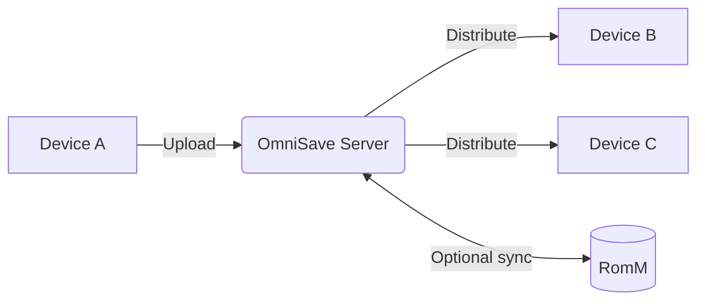

<p align="center">
  
</p>

<h1 align="center">OmniSave Server</h1>

<p align="center">
  Self-hosted save synchronization and version control for games across multiple devices.
</p>

<p align="center">
  <a href="#quick-start">Quick Start</a> ·
  <a href="#configuration">Configuration</a> ·
  <a href="#architecture">Architecture</a> ·
  <a href="#romm-integration">RomM</a> ·
  <a href="#security-model">Security</a> ·
  <a href="#development">Development</a>
</p>

---

If you play games across multiple devices, you know the problem: your handheld has an older save than your home console, and you have to remember which one is current — or manually transfer files before every session.

OmniSave solves this. When a save changes on one device, OmniSave automatically archives the previous version, makes the new save the active HEAD, and queues it for delivery to your other devices. Every previous version is kept. Nothing is ever silently overwritten.



---

## What OmniSave Does

At a high level:

1. A save changes on a device.
2. The client detects the change and uploads it to the server.
3. The server stores the save as an immutable snapshot, assigns it a global sequence number, and archives the prior version.
4. Other registered devices poll the delivery queue and download the new save.
5. On the next game launch, the device restores from the received save — the player continues where they left off.

If the upload is interrupted, the client resumes from the last verified byte. If the server crashes mid-processing, the save is recovered automatically on restart. If a device receives a bad save, the prior version is always available in the archive and can be pushed back manually from the web dashboard.

---

## Key Features

**Based on implemented code — nothing speculative.**

- **Resumable chunked upload** — the V2 upload protocol uses xxHash32 checkpoint ledgers (4 MB chunks, 64 MB HTTP windows). Uploads resume from the last verified offset after any interruption.
- **SHA-256 content deduplication** — identical saves are detected before storage. No duplicate artifacts; no sequence number wasted on unchanged content.
- **Immutable snapshot archive** — every unique save is stored permanently. Snapshots are only removed when you explicitly delete them from the dashboard. The server never auto-deletes a save that reached a committed state.
- **Global monotonic sequence numbers** — each title has a single per-title sequence counter, assigned atomically inside a `BEGIN IMMEDIATE` transaction. The snapshot with the highest sequence is HEAD.
- **Automatic fanout** — when a new save is committed, the server creates outbound delivery transactions for every peer device that has the title installed. Cross-user saves are blocked at the fanout boundary.
- **Multi-user support** — the admin account creates additional users. Devices are owned by users and can be shared with others via single-use share codes.
- **Profile mapping** — multiple in-game player profiles on a device can each be mapped to an OmniSave user account, so saves are routed to the right owner.
- **Per-device sync preferences** — sync can be disabled per-title per-device from the dashboard without affecting other devices.
- **Web dashboard** — a React SPA served directly from the same container: sync state matrix per game, snapshot history, error management, device management, manual push, and restore-all.
- **RomM integration** — optional bidirectional sync with a RomM instance. OmniSave pulls saves from RomM and pushes new snapshots back. Requires `ROMM_HOST` and `ROMM_API_KEY`.
- **Crash recovery** — on every startup, interrupted processing sessions are recovered, stale uploads are expired, missing archives are marked failed, and orphan staging directories are cleaned.
- **Periodic GC** — a background thread runs every 15 minutes to expire stale uploads and hard-delete old FAILED/DEDUPED rows (no committed snapshots are ever touched).

---

## Architecture

This repository is **the server only**. It runs on your hardware (Docker host, NAS, VPS) and acts as the central authority for all save state. It does not execute game code, read device memory, or make decisions about save content.

### Components

| Module | Role |
|---|---|
| `sync_api.py` | Upload flow: inbound transaction, manifest, window, commit, resume |
| `sync_deliver_api.py` | Delivery flow: claim, window download, ACK, error |
| `processing.py` | Background worker: hash, dedup, sequence assignment, archive move, outbound fork |
| `ui_api.py` | Dashboard REST API: auth, users, devices, games, snapshots, errors, labels |
| `romm_api.py` | RomM connection management API (UI-facing) |
| `romm_vsc.py` | RomM pull loop |
| `romm_worker.py` | RomM push worker |
| `romm_meta.py` | RomM HTTP client: fetch metadata, search ROMs, upload saves |
| `romm_index.py` | RomM catalog indexer: maps title IDs to ROM IDs |
| `titledb.py` | Game name resolution from titledb JSON |
| `database.py` | All SQL: schema, migrations, every read/write function |
| `startup.py` | Crash recovery and periodic GC |

### Storage model

- **Database**: single SQLite file at `$OMNISAVE_DATA/omnisave.db`, WAL mode, thread-safe via `LockedConnection` RLock wrapper.
- **Archive**: immutable save files stored at `$OMNISAVE_DATA/archive/{transaction_id}/save.zip`.
- **Staging**: in-flight upload buffers at `$OMNISAVE_DATA/staging/{session_id}/save.zip`, cleaned after processing.

### Sync state machine

Each inbound transaction moves through:

```
UPLOADING → PROCESSING → READY_FOR_RESTORE
                       → DEDUPED (identical content; no artifact)
                       → FAILED
```

Each outbound transaction:

```
READY_FOR_RESTORE → DELIVERING → COMPLETED
                              → FAILED
                  → SUPERSEDED (newer save arrived; this one replaced)
                  → CANCELLED (sync disabled for this title on this device)
```

### Authentication

- **Dashboard users**: username/password (PBKDF2-SHA256, 260,000 iterations), session tokens (`sk_live_` prefix), issued as HttpOnly cookies or Bearer tokens. Multi-session: each login creates an independent session.
- **Devices**: per-device bearer tokens (`sk_device_` prefix). Tokens are delivered to devices via a pairing flow — the device displays a short code in its overlay, the user claims it in the web UI. Tokens can also be issued or rotated directly from the dashboard.
- **Default credentials**: `admin` / `admin` on first run. **Change this before exposing the server to any network.**

---

## Quick Start

### Prerequisites

- Docker and Docker Compose

### Minimal setup

```yaml
# docker-compose.yml
services:
  omnisave:
    image: omnisave:latest
    build:
      context: ./server
      dockerfile: Dockerfile
    restart: unless-stopped
    ports:
      - "8991:8991"
    volumes:
      - ./data:/app/data
      - ./config:/app/config
```

```bash
docker compose up -d
```

The server starts on port `8991`. Open `http://<your-host>:8991` in a browser.

**First-run checklist:**

1. Log in with `admin` / `admin`.
2. Change the admin password immediately (Settings → Account).
3. Pair your first device (Devices → Add Device).
4. Optionally create additional user accounts (Admin → Users).

For bridge-only setups (no external network):

```bash
docker compose -f docker-compose.yml -f docker-compose.no-network.yml up -d
```

---

## Configuration

### Core

| Variable | Default | Description |
|---|---|---|
| `OMNISAVE_DATA` | `/app/data` | Directory for the SQLite database, archive files, and staging area. Mount a persistent volume here. |
| `OMNISAVE_PORT_INTERNAL` | `8991` | Port the uvicorn server listens on inside the container. |

### Admin password reset

If you lose access to the admin account, create an empty file at `/app/config/reset_admin.flag` inside the container (or in the `config` volume). On next request, the admin password is reset to `admin` and the flag is deleted.

```bash
docker exec omnisave touch /app/config/reset_admin.flag
# Then log in with admin/admin and change the password immediately.
```

---

## Usage

### Device pairing

<p align="center">
  
</p>

Devices that support the OmniSave client protocol appear in the web dashboard after their first connection. Each device displays a short pairing code in its overlay UI:

1. Open the web dashboard → **Devices** → **Add Device**.
2. Enter the pairing code displayed on the device.
3. The device receives a bearer token automatically on its next poll cycle.
4. Rename the device (optional) and assign a default player profile if needed.

### Save sync flow

Normal operation requires no user interaction:

1. A save changes on a device → client uploads to server.
2. Server stores the snapshot, assigns sequence number, queues delivery to peers.
3. Peer devices download the save on next queue poll.
4. Devices restore the save on next game launch.

<p align="center">
  
</p>

### Manual push

From the dashboard (Game → Snapshots → Push):

- Select any committed snapshot from a game's history.
- Choose target device(s). Leave empty to push to all registered devices.
- Optionally specify a target player profile per device.

The snapshot is queued as an outbound delivery and will be picked up by the target device on its next poll.

### Full device restore

Dashboard → Devices → (device) → **Restore All**:

Queues the current HEAD save for every game in the device's catalog. Intended for recovering a device after a reset or reinstall. Only titles the device reports as installed are included.

### Snapshot management

Dashboard → Games → (game) → Snapshots:

- Browse the full version history for any game.
- See which device produced each snapshot and when.
- Delete individual snapshots. The server enforces that HEAD cannot be silently replaced — deletion marks the transaction FAILED; any active outbound referencing the same archive is also failed.
- Any committed snapshot can be pushed back to devices manually.

### Per-device sync preferences

Dashboard → Devices → (device) → Games:

- Toggle sync on/off per title. When disabled, any pending outbound delivery for that title is cancelled immediately.

---

## Data Safety Model

### What is persisted

- Every snapshot that passes the upload pipeline and is assigned a sequence number is retained permanently in `$OMNISAVE_DATA/archive/`.
- SUPERSEDED snapshots (replaced by a newer save) are kept. Only you can delete them.
- DEDUPED uploads (content identical to an existing snapshot) produce no new archive file — the existing artifact is authoritative.

### What is not retained

- FAILED uploads that never produced a committed snapshot are hard-deleted after 7 days.
- Staging files (in-flight uploads) are cleaned after processing completes or after 12 hours of inactivity.

### Failure modes

| Scenario | Behavior |
|---|---|
| Upload interrupted | Client resumes from last verified offset. Session expires after 12 hours of inactivity. |
| Server crash during processing | On restart, interrupted sessions with an existing archive file are recovered. Others are expired. |
| Archive file deleted externally | Detected at startup and on every periodic GC cycle. Transaction is marked FAILED. No silent inconsistency. |
| Delivery to device fails | Transaction stays FAILED. Prior HEAD is preserved. Retry manually from dashboard or trigger retry-all. |
| Duplicate save content | Detected by SHA-256 hash. Marked DEDUPED. No extra storage used. |
| Client uploads a diverged save | Stored as a snapshot with diagnostic divergence logged. HEAD advances normally. No data is rejected. |

### What OmniSave does not guarantee

- **Filesystem durability** is the responsibility of your underlying storage. SQLite WAL mode provides consistency within a run, not protection against hardware failure. Use RAID, ZFS snapshots, or external backup for the `data/` volume.
- **No built-in TLS** — run a reverse proxy (nginx, Caddy, Traefik) in front of OmniSave if exposing to the internet or an untrusted LAN.
- **No built-in rate limiting** — the `5% free space` guard is the only admission control for uploads. Enforce limits at the reverse proxy layer if needed.

---

## RomM Integration

RomM integration is entirely optional. OmniSave's core save sync — between physical devices — works independently of RomM and requires no connection to it. If you only play on physical hardware and want saves kept in sync between those devices, you do not need RomM at all.

The integration becomes useful if you also play through an emulator or a platform that uses RomM as its save backend (web player, mobile emulator, etc.). In that case, RomM acts as a bridge: saves made on a physical device flow into OmniSave and then out to RomM, so they're available to emulators without manual export. Saves made in an emulator flow the other direction — into OmniSave and then out to your physical devices.

Beyond save sync, connecting RomM unlocks game artwork and names throughout the dashboard. Without RomM, games are identified only by their title ID. With RomM, cover art and display names are fetched and cached per-user, making the save history and device sync matrix considerably easier to read.

### What you get with RomM connected

- **Cover art and game names** in the dashboard, fetched from your RomM library and cached locally.
- **Saves from emulators available on physical devices** — anything saved in RomM-backed emulators is pulled into OmniSave and queued for delivery to your hardware.
- **Saves from physical devices available in emulators** — when a physical device uploads a new save, OmniSave pushes it to RomM automatically.
- **Auto-mapping** — when a new title is first seen, OmniSave searches your RomM library by game name and creates the title→ROM link automatically if exactly one match is found. You can also map titles manually from the game detail page.
- **RomM as a virtual device** — your RomM instance appears in the device list like any other client, with its own sync state per game.

### Setup

1. In the dashboard, go to **Settings → RomM** and enter your RomM URL and API key.
2. Ensure the API key has permission to read and write saves in RomM.
3. Existing titles will be auto-matched on next upload. You can also map titles manually from the game detail page.

### Multi-user RomM

Each user configures their own RomM connection independently via the dashboard. Credentials are stored per-user in the database.

---

## Security Model

### Trust assumptions

- OmniSave is designed for **trusted network** deployment: your home LAN, a private VPN, or a VPS accessible only to you and people you share devices with.
- There is no capability for untrusted public-facing deployment without additional hardening at the network/proxy layer.

### Auth model

- Dashboard auth: PBKDF2-SHA256 (260,000 iterations), constant-time comparison. Session tokens are randomly generated (32-byte URL-safe base64). Tokens are stored as HttpOnly cookies; Bearer header is also accepted for API use.
- Device auth: pre-shared bearer tokens scoped to a single device. Tokens are delivered out-of-band via the pairing code flow — the device never holds a credential until a logged-in user explicitly approves it.
- There is no unauthenticated API surface. All sync endpoints require a valid device token; all dashboard endpoints require a valid session token.
- Soft-deleted devices are rejected at the token auth layer even if their token was not explicitly revoked.

### What the server does and does not do

- The server stores and retrieves opaque binary files (save.zip archives). It does not interpret their contents.
- RomM integration is opt-in. When enabled, save archives are uploaded to the configured RomM instance. No save data goes to any other external service.

### Recommendations for internet-facing deployments

- Put OmniSave behind a reverse proxy with TLS termination.
- Change the admin password on first run.
- Consider restricting dashboard access by IP if using a VPS.
- The `config/reset_admin.flag` mechanism bypasses authentication — ensure the `config` volume is not world-writable.

---

## Clients & Protocol

The server exposes an open REST API. Any client that implements the sync protocol can participate.

**Current clients:**
- **Sysmodule client (custom firmware)** — a background module that watches for save changes and handles upload/download. Configured via the pairing code flow.
- **REST API** — fully documented via FastAPI's auto-generated OpenAPI schema at `/docs` (when running in development mode).

**Roadmap:**
- PC client (Playnite integration)
- Emulator support via the PC client
- Experimental cross-device save conversion
- Data retention automation (per-game and global retention policies)

---

## Development

### Requirements

- Python 3.11+
- Node.js 20+ (for the UI)

### Run tests

```bash
cd server
pip install -r requirements.txt
pytest
```

The test suite uses real SQLite databases (in-memory or tmp files) — no mocking of the database layer. Coverage report is generated to `coverage.xml`.

### Build the Docker image

```bash
docker build -t omnisave:latest ./server
```

The Dockerfile is a two-stage build: Node.js builds the React UI, then the Python stage copies the compiled static files and installs Python dependencies.

### Run locally without Docker

```bash
cd server
pip install -r requirements.txt
# Build the UI first, or the dashboard will return 503
cd ui && npm ci && npx vite build && cd ..
OMNISAVE_DATA=/tmp/omnisave python src/main.py
```

### Project structure

```
OmniSaveServer/
├── assets/                  # Logo and screenshot assets
├── context/                 # Design docs and planning artifacts
│   ├── server/              # Server architecture docs
│   └── frontend-v2-planning/
├── deploy/                  # Production docker-compose and .env template
└── server/
    ├── Dockerfile
    ├── src/                 # Python server source
    ├── ui/                  # React dashboard source
    └── tests/               # pytest test suite
```

### Contributing

1. Fork the repository.
2. Create a branch from `main`.
3. Write tests for any behavioral change.
4. Ensure `pytest` passes with no regressions.
5. Open a pull request with a clear description of what changed and why.

**Design constraints to respect:**
- The server never rejects or modifies save content. It stores and retrieves opaque bytes.
- A snapshot that has reached `READY_FOR_RESTORE` or `COMPLETED` must never be automatically deleted or overwritten. Only explicit user action via the UI can remove it.
- The `has_conflict` field is diagnostic telemetry only — it must never control sync behavior or be surfaced to the user as an action gate.
- SHA-256 dedup operates on content identity only. Two different devices uploading the same bytes is a legitimate case (e.g., game launched on both without playing).

---

## Troubleshooting

**Dashboard shows "UI not built"**

The React UI was not compiled before the Docker image was built, or the static files are missing. Rebuild the image or run `npm ci && npx vite build` in `server/ui/`.

**Device stuck as "unregistered" / no pairing code**

The device has not yet connected to the server. Ensure the client is pointed at the correct server address and port. The pairing code is generated on the device's first `POST /api/v1/sync/device-config` call.

**Delivery stuck in FAILED for a device**

From the dashboard: Devices → (device) → Errors → Retry, or retry from the game detail page. If the device was replaced or reset, use Restore All after re-pairing to re-queue all HEAD saves.

**Save shows as OUT_OF_SYNC for RomM device but a push is not queued**

The RomM virtual device has not received the HEAD snapshot via any delivery attempt. Trigger a manual push from the game's snapshot list, or wait for the next RomM worker cycle.

**Admin password lost**

```bash
docker exec <container> touch /app/config/reset_admin.flag
# On next request, password resets to 'admin'
```

**High disk usage**

FAILED and DEDUPED transactions are hard-deleted after 7 days automatically. All other committed snapshots are kept indefinitely. To reclaim space, delete snapshots manually from the game detail page, or delete entire games (which removes all associated transactions and archives).

---

## Project Status

OmniSave is under active development. The sync protocol, database schema, and core pipeline are stable; the frontend is being actively expanded.

**Tech stack:**
- Backend: Python 3.11, FastAPI, SQLite (WAL mode), uvicorn
- Frontend: React (Vite)
- Integrations: RomM (optional), blawar/titledb (optional, for game name resolution)

---

## License

OmniSave uses a split licensing model.

**Client Software** (sysmodule, UI SDK): [MIT License](LICENSE-MIT)

You are free to use, modify, distribute, and integrate the client components into other applications with minimal restrictions.

**Server Software** (this repository): [GNU Affero General Public License v3.0 (AGPLv3)](LICENSE-AGPL)

You are free to self-host the OmniSave server for personal or internal use. If you modify the server and provide it as a network-accessible service to others, the AGPLv3 requires you to make the modified server source available under the same license.

**OmniSave Cloud** (official managed hosting): proprietary commercial offering operated by the OmniSave project maintainers.
