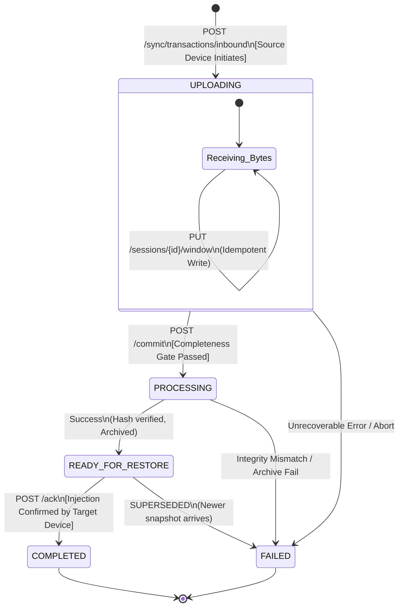

# OmniSave V2: State Machine & Execution Contract

## 1. Core States & Transitions

### `UPLOADING`

* **Trigger:** Source device initiates an upload (`POST /sync/transactions/inbound`).
* **Owner:** Device (mutates via idempotent window `PUT` requests).
* **Valid Next:** `PROCESSING` (on valid device `/commit`), `FAILED` (on unrecoverable error).
* **Completeness Gate (CRITICAL):** A transaction **CANNOT** transition to `PROCESSING` until the server verifies that the received byte count matches `total_size_bytes`. If a `/commit` is received prematurely, the server returns `400 Bad Request` and state remains `UPLOADING`.

### `PROCESSING`

* **Trigger:** Successful `/commit` (completeness gate passed).
* **Owner:** Server (Background Worker).
* **Action:** Assemble byte stream, SHA256 hash, archive, assign snapshot sequence, fork outbound transactions for peer devices.
* **Valid Next:** `READY_FOR_RESTORE` (on success), `FAILED` (if integrity hash fails or archive fails).
* **Rule:** The source device has no visibility into this state and considers the upload "done" once it receives a `202 Accepted` from the `/commit`.

### `READY_FOR_RESTORE`

* **Trigger:** Processing completes successfully. Server forks a new outbound transaction for target device(s).
* **Owner:** Server (Idle) / Target Device (read-only range downloads).
* **Valid Next:** `COMPLETED` (on valid `/ack` from target device), `FAILED`/`SUPERSEDED` (if newer snapshot displaces it).
* **Rule:** If a newer snapshot for the same game reaches `READY_FOR_RESTORE`, older idle transactions for that target device are automatically marked `SUPERSEDED` (soft-failed) to prevent out-of-order restores.
* **Rule:** Multiple devices may download the same snapshot concurrently without conflict — downloads are read-only range requests against the immutable archive.

### `COMPLETED`

* **Trigger:** Target device acknowledges successful injection (`POST /ack`).
* **Owner:** Server.
* **ACK Idempotency (CRITICAL):** If the server receives an `/ack` for a transaction that is already `COMPLETED` (e.g., due to a dropped network response causing the Switch to retry), the server returns `200 OK` and does nothing.

### `FAILED`

* **Trigger:** Unrecoverable error (e.g., cryptographic hash mismatch, disk write failure, or manual user abort).
* **Owner:** Server.
* **Rule:** Transient errors (e.g., Switch dropped WiFi during upload, or game was running during injection attempt) do **NOT** transition to `FAILED`. They rely on local client retry loops (re-sending windows or re-downloading). `FAILED` means the transaction is dead and requires starting over.

---

## 2. Global State Invariants & Durability Rules

1. **SQLite is the Absolute Authority:** The `sync_transactions.state` column defines reality. Files on disk in the staging folder are invisible to the system unless explicitly indexed in the `upload_sessions` table.
2. **Atomic Mutations:** Every state change or chunk indexing must execute entirely within a `BEGIN IMMEDIATE ... COMMIT` SQLite transaction block.
3. **Unidirectional Flow:** State never moves backward. There are no ephemeral lease states to expire or reset.
4. **Device Identity Enforcement:** The backend MUST reject (`403 Forbidden`) any mutation request if `X-Device-ID` does not match the `source_device_id` (inbound) or `target_device_id` (outbound) of the transaction.
